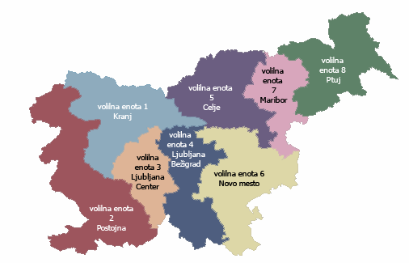
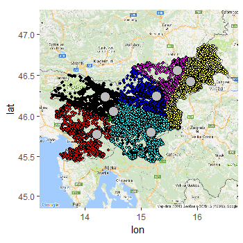
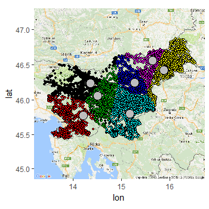

```{r setup, include=FALSE}
knitr::opts_chunk$set(echo = TRUE)
```
# Uvod

Gručenje že dolgo predstavlja enega temeljnih delov kombinatorične optimizacije in analize podatkov. V pričujoči projektni nalogi se bomo najprej seznanili z osnovnim teoretičnim ozadjem omejenega gručenja. Le-to bo v drugem delu predstavljalo osnovo za pisanje algoritma za optimalno gručenje, ki bo ravno reševanje linearnega programa.

V grobem si pri omejenem gručenju želimo dano množico obteženih točk množice $X$ v določenem prostoru $\mathcal{X}$ razdeliti na dano število $k$ gruč z vnaprej določeno težo.

Algoritem bova uporabila na dveh eksperimentih:

V prvem eksperimentu rešujemo problem oblikovanja volilnih enote. Zanima nas, kako razčleniti notranje območje države na posamezne volilne okraje. Pri tem zahtevamo, da okraji pokrivajo skoraj enake populacije volivcev in imajo »razumno« obliko.

V drugem eksperimentu imamo podatke o stanovanjih, ki se prodajajo v okolici Ljubljane. Glede na njihove lastnosti jih želimo razdeliti v gruče, tako da bo vsaka gruča vsebovala stanovanja s čim bolj podobnimi lastnostmi.

# Teoretični opis omejenega gručenja

Naj bosta $k, n \in \mathbb{N}$ in $\mathcal{X}$ poljuben prostor. Z $X= \{x_1,\ldots x_m\}\subset \mathcal{X}$ označimo množico točk s pripadajočimi utežmi $\Omega = (\omega_1,\ldots \omega_m)\in \mathbb{R}_{>0}^m$. Nadalje, naj bo $\mathcal{K}=(\kappa_1,\ldots ,\kappa_k)\in\mathbb{R}_{>0}^k$, tako da $\sum_{i=1}^k\kappa_i = \sum_{j=1}^m\omega_j.$ $\mathcal{K}$ je vektor željenih "velikosti" gruč. Naš cilj je poiskati take particije množice $X$, da bo skupna teža gruče $C_i$, v prej določeni normi "čim bližje" prepisanemu $\kappa_i.$

Uporabljali bomo spodnjo predpostavko, ki problem nekoliko poenostavi:

Naj bo $$C=(\xi_{i,j})_{\substack{i=1,\ldots ,k\\ j=1,\ldots ,m}} \in [0,1]^{k\times m},$$ tako da je vsota $\sum_{i=1}^k\xi_{i,j} = 1$ za vsak $j$. $C$ imenujemo delno gručenje množice $X$ in $\xi_{i,j}$ je del enote $j$ predpisane gruči $i$. Tako definirane $C_i=(\xi_{i,1},\ldots ,\xi_{i,m})$ imenujemo gruča $i$. Če je $C\in \{ 0,1\}^{k\times m}$, imenujemo gručenje celoštevilsko.

Teža gruče je podana z $\omega (C_i)=\sum_{j=1}^m \xi_{i,j}\omega_j$. Gručenje $C$ je močno uravnoteženo, če je $\omega (C_i)=\kappa_i$ za vsak $i$. Če so za teže grozdov dane zgornje in spodnje meje $\kappa_i^-, \kappa_i^+$ in velja: $\kappa_i^- < \sum_{j=1}^m\xi_{i,j}\omega_j < \kappa_i^+$ za vsak $i$, potem pravimo, da je gručenje $C$ šibko uravnoteženo. V posebnem primeru vzamemo $\kappa_i^-=(1-\epsilon)\kappa_i$ in  $\kappa_i^+=(1+\epsilon)\kappa_i$ za vsak $i$ in dan $\epsilon >0$ in tako gručenje imenujemo $\epsilon$-gručenje. Z $BC$ in $BC^{\epsilon}$ označujemo množici vseh močno uravnoteženih in $\epsilon$-uravnoteženih delnih gručenj.

Za program je potrebno definirati še funkcije $f_i:\mathcal{X} \to \mathbb{R}$, $i=$1,$\ldots$,k, ki določajo $C_i$, podmnožico $\mathcal{X}$ tako, da za vsak $x\in \mathcal{X}$ velja: če $f_i(x)$ je minimalen, potem $x\in C_i$.

Če želimo najti ustrezne rešitve je ključnega pomena, da dobro definiramo funkcije $f_i$. Za nabor parametrov $(\mathcal{D}, h, \mathcal{S}, \mathcal{M})$ tako definiramo $k$-terico funkcij $\mathcal{F}(\mathcal{D}, h, \mathcal{S}, \mathcal{M})=(f_i,\ldots ,f_k)$ s predpisom:
$$f_i(x)=h(d_i(s_i,x))+\mu_i,$$
kjer je:
\begin{itemize}

\item $\mathcal{D}=(d_1,\ldots ,d_k)$ $k$-terica metrik, oziroma predpisov za merjenje razdalj na prostoru $\mathcal{X}$, 
\item $h: \mathbb{R}_{\geq 0}\to\mathbb{R}_{\geq 0}$ monotono naraščajoča funkcija, 
\item $\mathcal{S}=(s_1,\ldots ,s_k)$ $k$-terica točk iz $\mathcal{X}$,
\item $\mathcal{M}=(\mu_1,\ldots ,\mu_k)\in \mathbb{R}^k.$

\end{itemize}
Če metrike $d_i$ niso identične, dobimo anizotropen primer. 

Primeri funkcij, ki jih lahko izberemo:
\begin{enumerate}
\item[1.] $f_i=\lVert x-s_i\rVert_2 + \mu_i$ v Evklidskem prostoru.
\item[2.] V diskretnem primeru, kjer velja $\mathcal{X}=X$, je dan povezan graf $G= (X, E, \delta)$; kjer $\delta: E \to \mathbb{R}_{>0}$ priredi vsaki povezavi neko pozitivno vrednost. Če je $d_G(x,y)$ definitana kot najkrajša pot od $x$ do $y$, to inducira metriko na $\mathcal{X}$. Torej dobimo funkcije $f_i$ oblike: $f_i = d_G(s_i, x) + \mu_i.$
\end{enumerate}

Videli bomo, da parametra $\mathcal{D}$ in $h$ v glavnem določata karakteristike končnih diagramov. Točke si služijo kot referenčne točke za določanje gruč.

Da se pokazati, da za vsako izbiro $\mathcal{D}$, $h$ in $\mathcal{S}$, obstaja izbira dodatnih parametrov $\mathcal{M}$ takšna, da so porojene gruče tako predpisanih tež kot tudi optimalno porazdeljene.

Parametre  $\mathcal{D}$, $h$ in $\mathcal{S}$ imenujemo strukturni parametri,  $\mathcal{M}$ pa izbirni parameter. Za vsako izbiro strukturnih parametrov izbirni parameter $\mathcal{M}$ dobimo z rešitvijo linearnega programa.

# Algoritem

Dokazati se da, da je rešitev problema optimalnega gručenja ravno rešitev linearnega programa, oziroma njegovega duala.

Algoritem linearnega programa je naslednje oblike:

vhodni podatki:
\begin{itemize}
\item množica točk $X= \{x_1,\ldots x_m\}\subset \mathcal{X}$, ki jo bomo razdelili na gruče,
\item uteži $\Omega = (\omega_1,\ldots \omega_m)$ na točkah
\item središča gruč $\mathcal{S}=(s_1,\ldots ,s_k)$
\item razdalje $\mathcal{D}=(d_1,\ldots ,d_k)$,
\end{itemize}
izhodni podatki: matrika  $$C=(\xi_{i,j})_{\substack{i=1,\ldots ,k\\ j=1,\ldots ,m}} \in [0,1]^{k\times m},$$ ki določa, v katerih gručah se posamezne točke nahajajo.

Minimiziramo:$$\sum_{i=1}^k\sum_{j=1}^m\xi_{i,j}\omega_j d_i(s_i,x_j)$$ pri pogojih $$\sum_{i=1}^k\xi_{i,j}=1, \hspace{1cm} j=1,\ldots ,m$$ $$\sum_{j=1}^m\xi_{i,j}\omega_j=\kappa_i \hspace{1cm} i=1,\ldots ,k$$ $$\xi_{i,j}>0\hspace{1cm} j=1,\ldots ,m; i=1,\ldots ,k.$$

Z vpeljavo pomožnih spremenljivk $E=(\eta_1,\ldots ,\eta_m)$ lahko zgornjemu programu priredimo dual oblike:\\
maksimiziramo $$\sum_{j=1}^m\omega_j\eta_j-\sum_{i=1}^k\kappa_i\mu_i$$ pri pogojih $$\eta_j \leq d_i(s_i,x_j)+\mu_i\hspace{1cm} j=1,\ldots ,m; i=1,\ldots ,k.$$ Očitno velja, da parametri $\eta_j, j=1,\ldots ,m$ zadoščajo enakosti $$\eta_j=\min_{i=1,\ldots ,k}d_i(s_i,x_j)+\mu_i.$$
Psevdo kodo algoritmov si lahko ogledate v datotekah "LinearniProgram.R", "DualniLinearniProgram.R".

# Eksperiment gručenja volilnih enot

Cilj tega eksperimenta je bil določiti volilne okraje Slovenije, ki imajo približno enako število prebivalcev.
Podatke smo pridobili na sledeč način: najprej smo pridobili število prebivalcev za slovenske kraje (datoteka "eksperiment_volitve/uvoz/populacije_krajev.csv"). Nato smo s funkcijo "geocode" pridobili koordinate krajev. Zaradi omejitev, ki jih ima funkcija "geocode", je ta postopek trajal dolgo časa. Nato smo pridobljene podatke shranili v novo datoteko (eksperiment_volitve/tabela_krajev_populacij_koordinat.csv), ki smo jo v nadaljevanju uporabljali (koda pridobivanja koordinat je v datoteki "eksperiment_volitve/uvoz/koordinate.R").

## Podatki
S pridobljenimi podatki smo začela konstruirat ustrezen linearni program. Na spletu ("https://sl.wikipedia.org/wiki/Volilne_enote_v_Sloveniji") smo dobila željene informacije o volilnih enotah. Slovenija je razdeljena na 8 enot: Kranj, Postojna, Ljubljana Center, Ljubljana Bežigrad, Celje, Novo mesto, Maribor in Ptuj. Vsaka enota ima približno 200000 volilnih upravičencev. Ker pa smo v nasi nalogi upostevali vse prebivalce in ne le volilnih upravicencev, smo dobili nekoliko večje število na enoto. Prav tako nismo imeli podatkov za posamezne dele Ljubljane, zato smo se odločili, da bomo ločili primere:
\begin{itemize}
\item enoti Ljubljana Center in Ljubljana Bežigrad združimo v mesto Ljubljana in obravnavamo kot eno enoto,
\item Ljubljano postavimo samo kot eno enoto (Ljubljana ima prebivalcev približno ravno za eno enoto) in nato še kot središče ene enote, tako da dobimo dve enoti s središčem v Ljubljani.
\end{itemize}

## Vrste uporabljenih norm
Za razdalje med točkami (mesti) smo uporabili Evklidsko normo $$\lVert x\rVert = \sqrt{x_1^2 + x_2^2},$$ kjer je $x$ vektor $x = (x_1,x_2)$, ter elipsoidno normo. Elipsoidna norma je definirana na sledeč način:
na podlagi celoštevilske rešitve iz Evklidskega primera smo najprej določili ustrezna središča po formuli $$s_i = c(C_i) = \frac{1}{\kappa_i}\sum_{j=1}^m\xi_{i,j}\omega_jx_j$$ za $i=1,\ldots ,k$. Pomožne uteži, ki jih potrebujemo za nadalno računanje, smo določili po formuli $\omega(C_i)=\sum_{j=1}^m\xi_{i,j}\omega_j$. Potem smo vsakemu središču določili matriko $$V_i=\sum_{j=1}^m\frac{\xi_{i,j}^o\omega_j}{\omega(C_i^o)}(x_j-c(C_i^o))(x_j-c(C_i^o))^T.$$ S pomočjo singularnega razcepa (funkcija svd) dobimo ortogonalno matriko Q in $\sigma_1^{(i)},\sigma_2^{(i)}>0$, tako da je $V_i = Q*diag(\sigma_1^{(i)},\sigma_2^{(i)})*Q^T.$ Sedaj definiramo $M_i=Q*diag((\sigma_1^{(i)})^{-1},(\sigma_2^{(i)})^{-1})*Q^T$ in sledi norma podana s predpisom $$\lVert x\rVert_{M_i} = \sqrt{x^TM_ix}.$$

## Linearni program
V datoteki "eksperiment_volitve/LinearniProgram_volitve.R" je spremenjen linearni program, ki smo ga uporabljali za ta eksperiment. V linearnem programu, ki je opisan v uvodu, imamo stroge enakosti za pogoje, ki določajo velikosti gruč. Zaradi fleksibilnosti pa bodo željene velikosti enot lahko večje, zato pri teh pogojih spremenimo enačaje v "<=" (vrstica 46). 
V Evklidskem primeru so norme za vsa središča iste, pri eliptičnem primeru pa iz definicije vidimo, da je za vsako središče definirana svoja norma. Zato za ta linearni program določimo vektor, ki izračuna vse norme (dolžine je kolikor je središč), nato pa uporabi za vsako središče ustrezno normo (vrstica 21).

## Izvajanje eksperimenta in rezultati
Koda eksperimenta je v datoteki "eksperiment_volitve/volitve.R". Ponovili smo ga za tri primere:

\begin{itemize}
\item Ljubljana kot eno središče in uporabljena Evklidska norma,
\item Ljubljana kot dve središči in uporabljena Evklidska norma,
\item Ljubljana kot eno središče in uporabljena elipsoidna norma.
\end{itemize}

V kodi lahko s spreminjanjem $p$-ja spremenimo Evklidsko normo v $p$-to normo (vrstici 76 in 228). Tako dobimo drugačne oblike enot. V naših primerih smo uporabljali $p=2$.

Spodaj so grafični prikazi rezultatov: prva slika je iz spleta in predstavlja volilne enote kot so v resnici, pri drugi sliki je v Ljubljani ena enota in uporabljena je Evklidska norma, tretja slika predstavlja v Ljubljani dve enoti in Evklidsko normo, četrta slika pa prikazuje spet le eno enoto v Ljubljani in uporablja zgoraj definirano elipsoidno normo.

```{r ena,echo = FALSE, warning = FALSE, out.width="50%"}
library(knitr)



```
\hspace*{3.5cm} 1. \hspace{8.8cm} 2.
```{r dva,echo = FALSE, warning = FALSE, out.width="50%"}
library(knitr)


```
\hspace*{4.5cm} 3. \hspace{7.8cm} 4.

Rezultati so zelo podobni realnim podatkom. Največ odstopanj je v osredni Slovenij in iz prehoda iz osrednje v vzhodno. Pomembno se je zavedati, da smo pri tem eksperimentu uporabljali zračno razdaljo med kraji. Ta ne upošteva geografskih dejavnikov, ki imajo vlogo predvsem v severozahodni Sloveniji. Pri določanju volilnih enot pa je vlada najbrž upoštevala tudi take dejavnike in je enote določila tudi na podlagi dostopnosti kraja do središča.